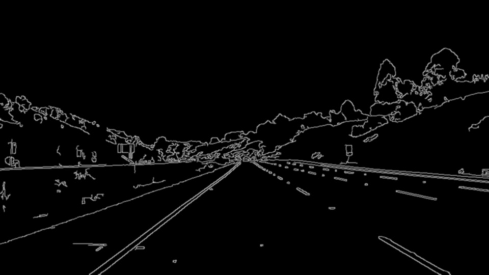
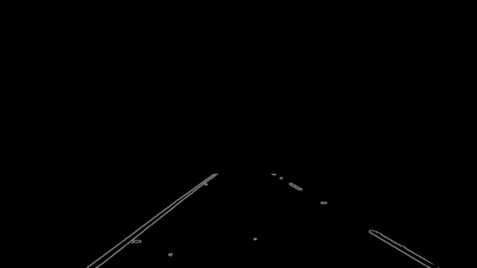
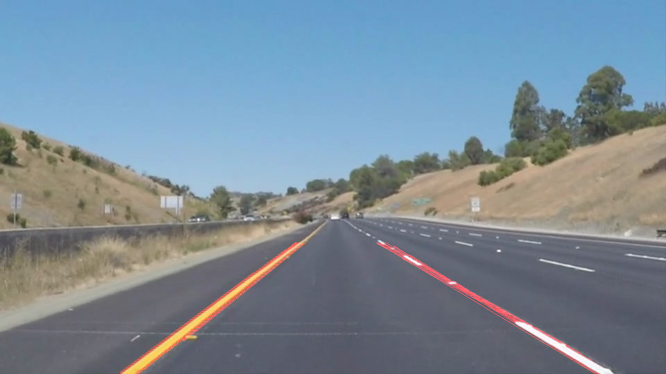
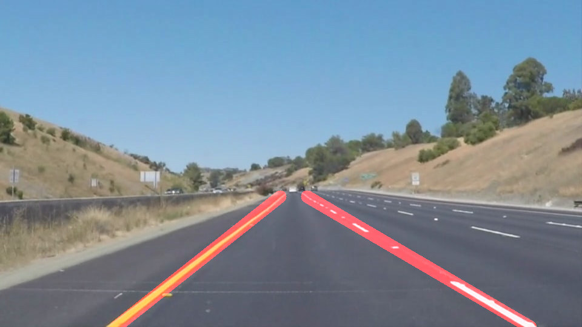

# **Finding Lane Lines on the Road** 

Pipeline.
---
Piplene for finding lane lines on the road on images and video consisted of 6 steps:

1\) First convert image in grayscale. This is necessary for the algorithm of finding edges (step 2). 
   
2) Show edges on image by canny edge alghoritm and also convert to black and white picture. 
   
3) Apply gaussian blur. 
   
4) Apply mask on picture, which cut off space on image which not contain lane lines. 
   
5) Using hough transform algorithm find lines on image. The algorithm is configured in such a way as to find lane lines more suitable for road. 
   
6) The received lines on step 4 are sorted to the right and left line. Then they are extrapolated to bottom of image and made left and right single lane line. They are extrapolated by calculating average values of slope and intercept. Extrapolated lines are drawed on the original pictures.  
  

Identify potential shortcomings with your current pipeline
---
Pipeline is not ideal and sometimes lines crossed. I think it's come from not ideal alghorithm for finding edges and can be fixed by correct colorization image.

Also it's not tested in some difficult situations. When night or when foggy wheather, raind and in other climate conditions.

Another shortcoming it's perfomance, I think use this pipeline in realtime of video processing is not good idea. 

Suggest possible improvements to your pipeline
---
A possible improvement would be more effective edge detection, which allow remove lines which not part of car lane line.

Also we can use past positions of car lane lines and make predictions where car lane can be.
